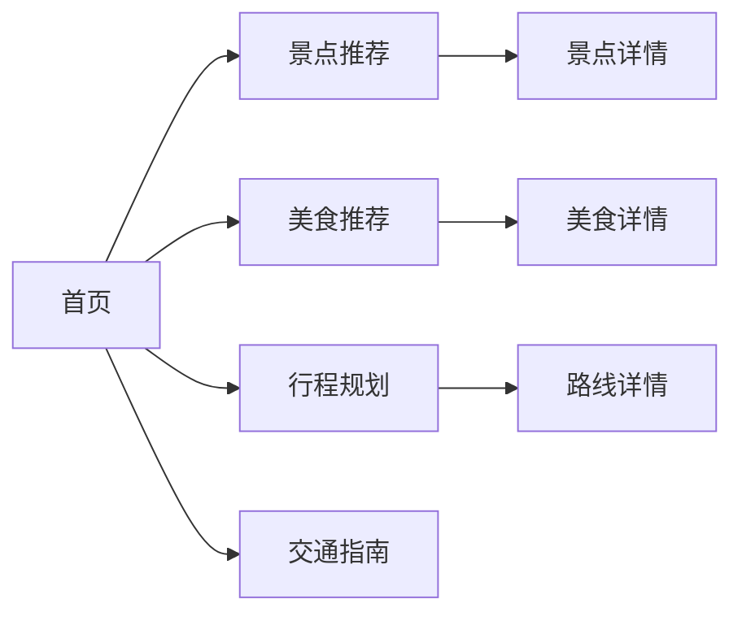

## 1. Product Overview
青岛旅游攻略图是一款交互式网页应用，为游客提供青岛旅游的全方位指南，包括景点推荐、美食介绍、行程规划和交通指南。
- 帮助游客快速了解青岛必去景点和特色美食
- 提供详细的行程规划建议，提升旅游体验

## 2. Core Features

### 2.1 User Roles
| Role | Registration Method | Core Permissions |
|------|---------------------|------------------|
| Tourist | None | Browse all content |

### 2.2 Feature Module
1. **首页**: 青岛概览、热门景点快速入口、天气信息
2. **景点推荐**: 详细景点介绍、图片展示、门票信息
3. **美食推荐**: 特色海鲜、小吃、啤酒文化
4. **行程规划**: 一日游、三日游路线推荐
5. **交通指南**: 机场、地铁、公交信息

### 2.3 Page Details
| Page Name | Module Name | Feature description |
|-----------|-------------|---------------------|
| 首页 | Hero区域 | 青岛城市形象大图，动态展示 |
| 首页 | 景点导航 | 热门景点卡片，点击跳转详情 |
| 景点推荐 | 景点列表 | 卡片式展示，包含图片和简介 |
| 美食推荐 | 美食分类 | 按类别展示特色美食 |
| 行程规划 | 路线推荐 | 多日游路线规划 |
| 交通指南 | 交通信息 | 机场、地铁、公交指南 |

## 3. Core Process
用户进入首页 → 浏览景点/美食 → 查看详细信息 → 获取行程建议 → 规划旅行

## 4. User Interface Design
### 4.1 Design Style
- 主色调: 海洋蓝 (#1E90FF) 配合金色点缀 (#FFD700)
- 辅助色: 清新绿色 (#32CD32) 用于强调
- 按钮样式: 圆角矩形，渐变背景
- 字体: 思源黑体，现代简洁
- 布局: 卡片式设计，响应式网格
- 图标: 海洋主题图标

### 4.2 Page Design Overview
| Page Name | Module Name | UI Elements |
|-----------|-------------|-------------|
| 首页 | Hero区域 | 全屏背景图，渐变遮罩，白色大标题 |
| 首页 | 景点卡片 | 圆角卡片，图片覆盖，悬浮效果 |
| 景点推荐 | 列表页 | 瀑布流布局，卡片阴影 |
| 美食推荐 | 分类标签 | 顶部标签切换，下方内容展示 |

### 4.3 Responsiveness
- 桌面端: 多列网格布局
- 平板端: 双列布局
- 移动端: 单列布局，侧边栏转为底部导航

### 4.4 3D Scene Guidance
- 环境: 海洋蓝色调，清爽明亮
- 动画: 波浪效果、卡片悬浮动效
- 交互: 点击卡片展开详情、平滑滚动