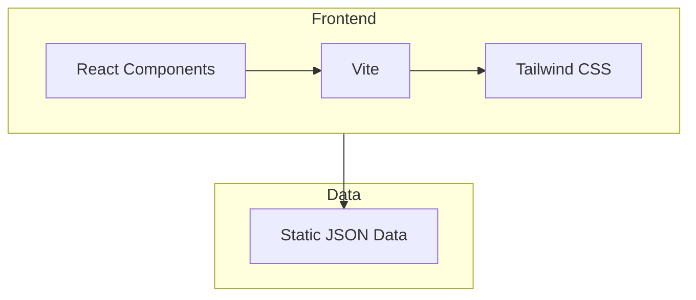
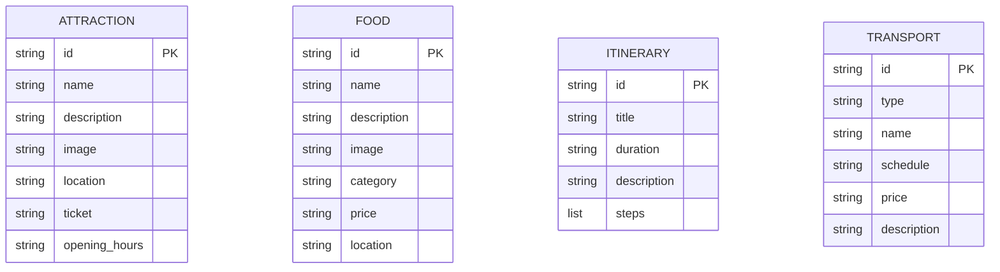

## 1. Architecture Design


## 2. Technology Description
- Frontend: React@18 + TypeScript + tailwindcss@3 + vite@6
- Initialization Tool: vite-init
- Backend: None (纯前端静态数据)
- Database: None (使用静态JSON数据)

## 3. Route Definitions
| Route | Purpose |
|-------|---------|
| / | 首页，展示青岛概览和导航入口 |
| /attractions | 景点推荐页面 |
| /food | 美食推荐页面 |
| /itinerary | 行程规划页面 |
| /transport | 交通指南页面 |

## 4. API Definitions
无后端API，使用静态JSON数据

## 5. Server Architecture Diagram
无需后端服务器

## 6. Data Model
### 6.1 Data Model Definition


### 6.2 Data Definition Language
使用JSON文件存储数据：
- src/data/attractions.json
- src/data/food.json
- src/data/itinerary.json
- src/data/transport.json

## 7. Project Structure
```
src/
├── components/
│   ├── Header.tsx
│   ├── Footer.tsx
│   ├── Hero.tsx
│   ├── AttractionCard.tsx
│   ├── FoodCard.tsx
│   └── ItineraryCard.tsx
├── pages/
│   ├── Home.tsx
│   ├── Attractions.tsx
│   ├── Food.tsx
│   ├── Itinerary.tsx
│   └── Transport.tsx
├── data/
│   ├── attractions.json
│   ├── food.json
│   ├── itinerary.json
│   └── transport.json
├── App.tsx
├── main.tsx
└── index.css
```